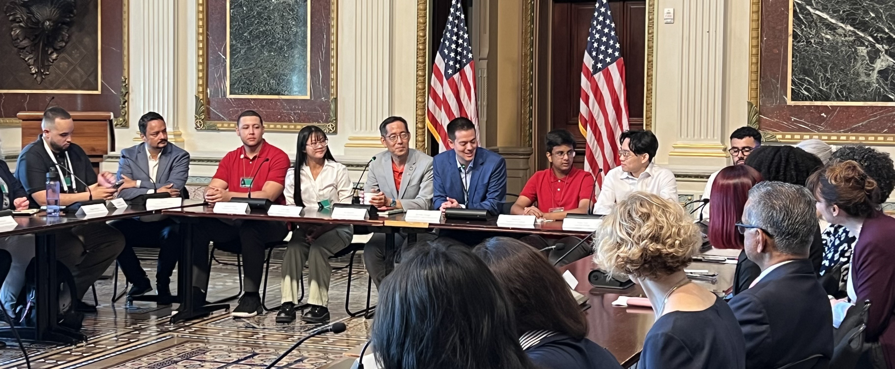
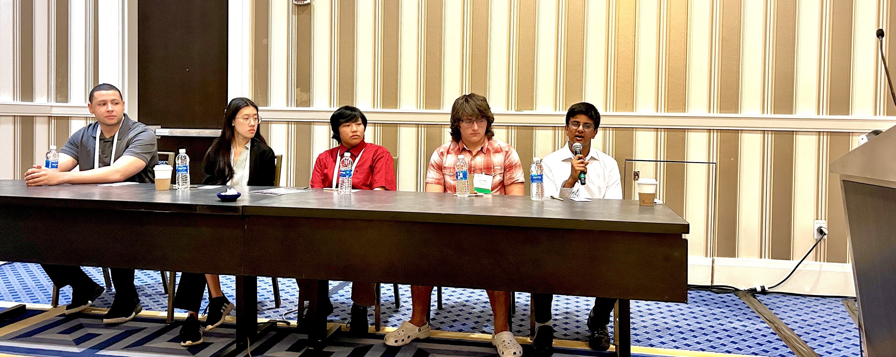
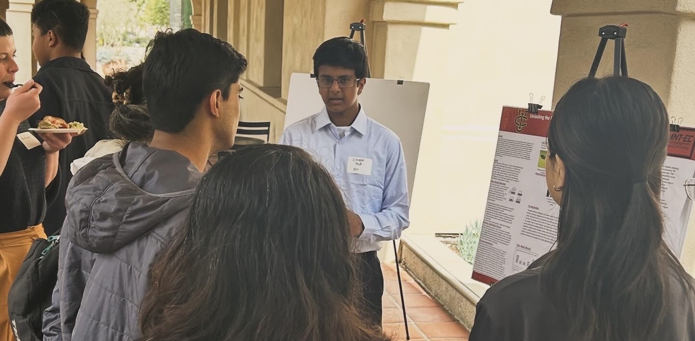

<html lang="en">
    <head>
        <link rel="stylesheet" href="styles.css">
        <title>Ishan Jha</title>
    </head>
    <body>
        <!-- Navigation Bar -->
        <nav class="navbar">
            

                <a href="index.html" class="nav-title" style="text-decoration: none;">Ishan Jha</a>
                

                    <a href="projects.html" class="nav-link">Projects</a>
                    <!-- <a href="https://github.com/Ishanyjha/ishanyjha.github.io/blob/main/snip.JPG?raw=true" target="_blank" class="nav-link">CV</a> -->
                    <a href="example.com" target="_blank" class="nav-link">Google Scholar</a>
                    <a href="example.com" target="_blank" class="nav-link">GitHub</a>
                

            

        </nav>

        <!-- Banner -->
        

            
        

        <!-- Header
        <h1>Ishan Jha</h1> -->

        <!-- Introduction -->
        
Greetings, I am a ninth grader at Troy High School in Fullerton California.

        
My pasions are theoretical mathematics, artificial intelligence, and its applications. Within mathematics, my interests are in topology and differential geometry. I also enjoy studying the applications of these ideas in machine learning, and the applications of machine learning in industry.

        
Another passion of mine is conducting academic research, helping students with math at the UCI Math Circle, and presenting at conferences in AI.

        <!-- Social Links
        

            <a href="example.com" class="arrow-link">Google Scholar</a>
            <a href="example.com" class="arrow-link">GitHub</a>
        
 -->

        <!-- Publications Section -->
        <h2>Publications</h2>
        <ul class="publications">
            <li>
                
AI-Powered VR Simulations for Semiconductor Industry Training and Education

                
I. Jha, G. Codina, A. Dong, A. Rodriguez, F. Chen, J. Zhu, K. Hong 

                
<i>Journal of Advanced Technological Education</i>

                
Accepted November 27, 2024

                

                    <a href="https://github.com/Ishanyjha/ishanyjha.github.io/blob/cc91b88b509d26d686f32ebf886e378f5ed2b855/Final%20AI-Powered%20VR%20Simulations%20for%20Semiconductor%20Industry%20Training%20and%20Education_JP%20edited_12-3-24.docx%20(1).pdf" target="_blank" class="arrow-link">paper</a>
                    <a href="https://youtu.be/Ri-jqU0WzQM" target="_blank" class="arrow-link">video demo (short)</a>
                

        </ul>

        <!-- Preprints Section -->
        <h2>Preprints and Reports</h2>
        <h6>*denotes equal contribution</h6>
        <ul class="publications">
            <li>
                
Example

                
Example, Example*

                
Example

                
Example N, Example

                

                    <a href="https://github.com/sdkyuanpanda/SSP-CUB-2024/blob/b5678afb9f23b7d1544910b107fa32d53cd66db2/ssp_team08_final_report-1.pdf" target="_blank" class="arrow-link">paper</a>
                    <a href="https://github.com/sdkyuanpanda/SSP-CUB-2024/blob/b5678afb9f23b7d1544910b107fa32d53cd66db2/od/ssp_team08_orbital_integration_project_slides.pdf" target="_blank" class="arrow-link">slides</a>
                    <a href="https://github.com/sdkyuanpanda/SSP-CUB-2024" target="_blank" class="arrow-link">code</a>
                

            </li>
        </ul>

  <!-- presenting Section -->
        <h2>Presentations</h2>
        <h6>*denotes equal contribution</h6>
        <ul class="presentations">
            <li>
                
AI For Education and Training

                
Ishan Jha

                
<i>Orange County Dept. of Education Future Leaders AI Conference</i>

                
Presentation, J.W Marriot Anaheim

                
MM DD, YYYY

                

                    <a href="https://www.nature.com/articles/s41598-024-61040-3" target="_blank" class="arrow-link">slides</a>
                

            </li>
            <li>
                
Student Centered Undergraduate Research Experiences in Creating Virtual Digital Twin Cleanroom.”

                
Ishan Jha, Kristal Hong, Gabriel Codina, Alice Dong

                
<i>TechConnect 2024 World Innovation Conference</i>

                
Poster and Panel Presentations, Gaylord National Hotel and Center

                
MM DD, YYYY

                

                    <a href="https://github.com/Ishanyjha/ishanyjha.github.io/blob/cc91b88b509d26d686f32ebf886e378f5ed2b855/UCI%20START%20Academic%20Poster%20(1).pdf" target="_blank" class="arrow-link">poster</a>
                

            </li>
            <li>
                
Digital Twins for Semiconductor Fabrication Education.”

                
Ishan Jha, Felicia Chen, Gabriel Codina, Alice Dong, Alexis Rodriguez

                
<i>California Institute of Technology</i>

                
Invited Presentation, Moore Courtyard, Electrical Engineering Dept.

                
MM DD, YYYY

                

                    <a href="https://github.com/Ishanyjha/ishanyjha.github.io/blob/cc91b88b509d26d686f32ebf886e378f5ed2b855/UCI%20START%20Academic%20Poster%20(1).pdf" target="_blank" class="arrow-link">poster</a>
                

            </li>
            <li>
                
Empowering Students Through AI Clubs.”

                
Ishan Jha

                
<i>Orange County Dept. of Education, Student AI Summit</i>

                
Presentation, J.W Marriot Anaheim.

                
MM DD, YYYY

                

                    <a href="https://www.nature.com/articles/s41598-024-61040-3" target="_blank" class="arrow-link">poster</a>
                    <a href="https://www.youtube.com/watch?v=NugQOMaJuuw" target="_blank" class="arrow-link">video</a>
                

            </li>
        </ul>

        <!-- Contacts Section -->
        
If you have questions about my work or if you'd just like to chat, please feel free to reach out at:

        
ishanyjha [at] gmail [dot] com 

<meta charset="UTF-8">
<meta name="viewport" content="width=device-width, initial-scale=1.0">
<title>Image Slideshow</title>

</head>
<body>

<!-- Slideshow container -->

    
1 / 5

    
    
At TechConnect in D.C

    
2 / 5

    
    
At the White House

    
3 / 5

    
    
At a roundtable in the White House

    
4 / 5

    
    
Panel presentation at TechConnect

    
5 / 5

    
    
At Caltech

<!-- Next and previous buttons -->
<a class="prev" onclick="plusSlides(-1)">&#10094;</a>
<a class="next" onclick="plusSlides(1)">&#10095;</a>

<!-- The dots/circles -->

        <!-- Footer -->
        <footer>
            
Copyright &copy; Free to Use.

        </footer>
    </body>
</html>
