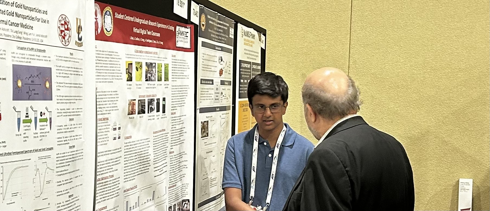
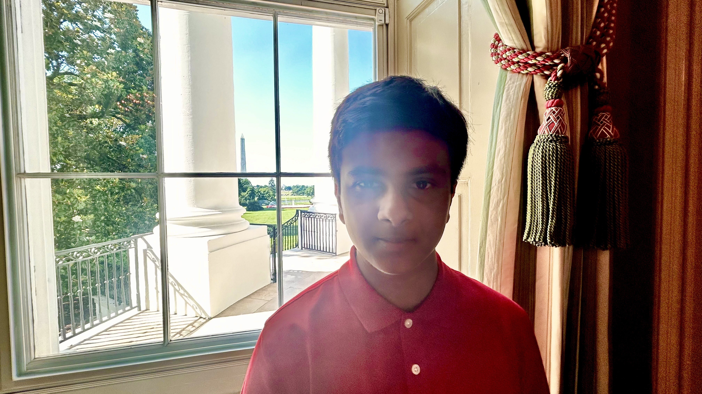

<html lang="en">
<head>
    <meta charset="UTF-8">
    <meta name="viewport" content="width=device-width, initial-scale=1.0">
    <link rel="stylesheet" href="styles.css">
    
</head>
<body>

        <!-- Navigation Bar -->
        <nav class="navbar">
            

                <a href="index.html" class="nav-title" style="text-decoration: none;">Ishan Jha</a>
                

                    <a href="projects.html" class="nav-link">Projects</a>
                    <!-- <a href="assets/Main_e5905a25-9683-46d6-865c-aaed7ef06243_720x.png" target="_blank" class="nav-link">CV</a> -->
                    <a href="https://scholar.google.com/citations?user=KJxBoMAAAAAJ&hl=en&" target="_blank" class="nav-link">Google Scholar</a>
                    <a href="https://github.com/ishanyjha" target="_blank" class="nav-link">GitHub</a>
                

            

        </nav>

        <!-- Introduction -->
        <section>
            <h1>
Welcome!
</h1>
            
Greetings, I am a ninth grader at Troy High School in Fullerton, California.

            
My passions are theoretical mathematics, artificial intelligence, and its applications. Within artificial intelligence, my interests include geometric deep learning and physics-informed neural networks (PINNS, PINOs, PFNOs, SB/PI-NNs) which I am exploring through literature and projects. I also enjoy studying the applications of these ideas in machine learning and industry.

            
Another passion of mine is conducting academic research, helping students with math at the UCI Math Circle, and presenting at conferences in AI. I love connecting with like minded people who are interested in AI, math, and research!

        </section>

        <!-- Publications Section -->
        <section>
            <h2>
Publications
</h2>
            <ul class="publications">
                <li>
                
AI-Powered VR Simulations for Semiconductor Industry Training and Education

                
I. Jha, G. Codina, A. Dong, K. Hong, A. Rodriguez, F. Chen, J. Zhu, G.P Li

                
<i>Journal of Advanced Technological Education</i>

                
Accepted November 27, 2024

                

                    <a href="https://zenodo.org/records/14933891" target="_blank" class="arrow-link">paper</a>
                    <a href="https://www.youtube.com/watch?v=Ri-jqU0WzQM&t=5s" class="arrow-link">video demo</a>
                    <a href="https://www.nsf.gov/news/sparking-curiosity-future-semiconductor-workforce" class="arrow-link">NSF feature</a>
                

                </li>
            </ul>
        </section>
        <section>
            <h2>
Presentations
</h2>
            <ul class="publications">
                <li>
                
AI For Education and Training

                
Ishan Jha, Others

                
Orange County Department of Education

                
<i>Future Leaders AI Conference</i>
                
                
Presentation, J.W Marriot

                
November 20, 2024

                

                    <a href="https://docs.google.com/presentation/d/1trymELfKDnHdj340TnMqMLKF8STPKpN9xWVmITHn03Y/edit?usp=sharing" target="_blank" class="arrow-link">paper</a>      
                

                </li>
                <li>
                
Student Centered Undergraduate Research Experiences in Creating Virtual Digital Twin Cleanroom.

                
Ishan Jha, Gabriel Codina, Alice Dong, Kristal Hong

                
TechConnect World Innovation Conference

                
<i>XRAI for Training Symposium</i>
                
                
Poster presentation and panel, The Gaylord National Hotel

                
June 16-17, 2024

                

                    <a href="https://github.com/Ishanyjha/ishanyjha.github.io/blob/2c21d5897545eb75615c337f28bb3d09b966de41/UCI%20START%20Academic%20Poster%20(1).pdf" target="_blank" class="arrow-link">poster</a>               
                

                </li>
                <li>
                
Digital Twins for Semiconductor Fabrication Education.

                
Ishan Jha, Gabriel Codina, Alice Dong, Kristal Hong, Felicia Chen

                
California Institue of Technology

                
<i>Kavli Nanoscience Institute</i>
                
                
Poster and presentation, Moore Courtyard and EECS Bldg.

                
May 24, 2024

                

                    <a href="https://github.com/Ishanyjha/ishanyjha.github.io/blob/2c21d5897545eb75615c337f28bb3d09b966de41/UCI%20START%20Academic%20Poster%20(1).pdf" target="_blank" class="arrow-link">poster</a>                
                

                </li>  
                <li>
                
Empowering Students Through AI Clubs

                
Ishan Jha

                
Orange County Department of Education

                
<i>Student AI Convening</i>
                
                
Presentation, J.W Marriot

                
May 4, 2024

                

                    <a href="https://docs.google.com/presentation/d/1hj7_zbnqVg7TAxt5kjAVCEwvPyUrD_DBp5Ijl_JvQo8/edit?usp=sharing" target="_blank" class="arrow-link">paper</a>
                    <a href="https://www.youtube.com/watch?v=NugQOMaJuuw" class="arrow-link">video demo</a>                
                

                </li>            
            </ul>
        </section>

        <!-- Slideshow -->
        <section>
            <h2>
Gallery
</h2>
            

                

                    
                    
At TechConnect in D.C

                

                

                    
                    
At the White House

                

                <a class="prev" onclick="plusSlides(-1)">&#10094;</a>
                <a class="next" onclick="plusSlides(1)">&#10095;</a>
            

            

                
                
            

        </section>

        <!-- Footer -->
        <footer>
            Copyright &copy; Free to Use.
        </footer>
    

    
        <footer>
            
Copyright &copy; 2025 Ishan Jha

        </footer></body>
</html>
